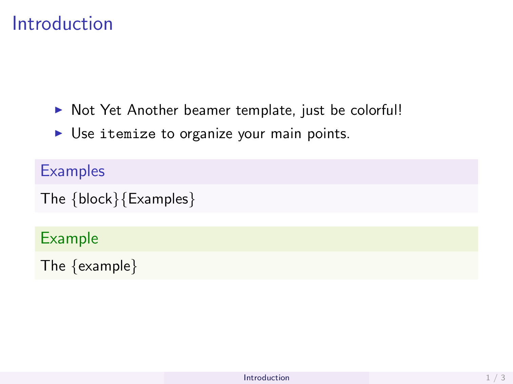
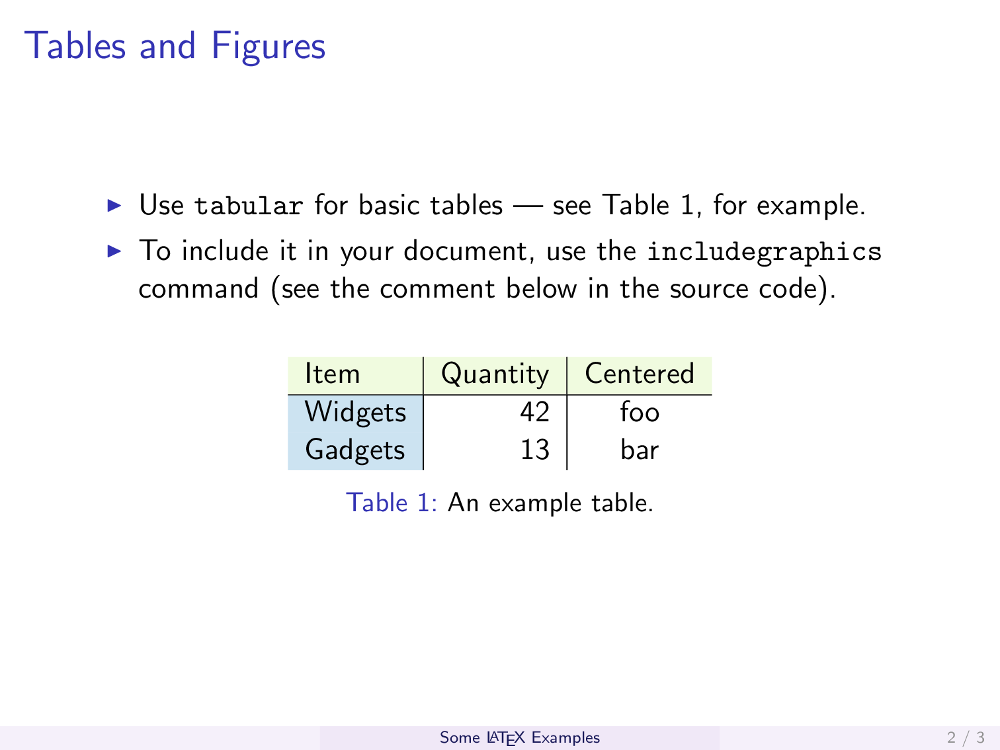
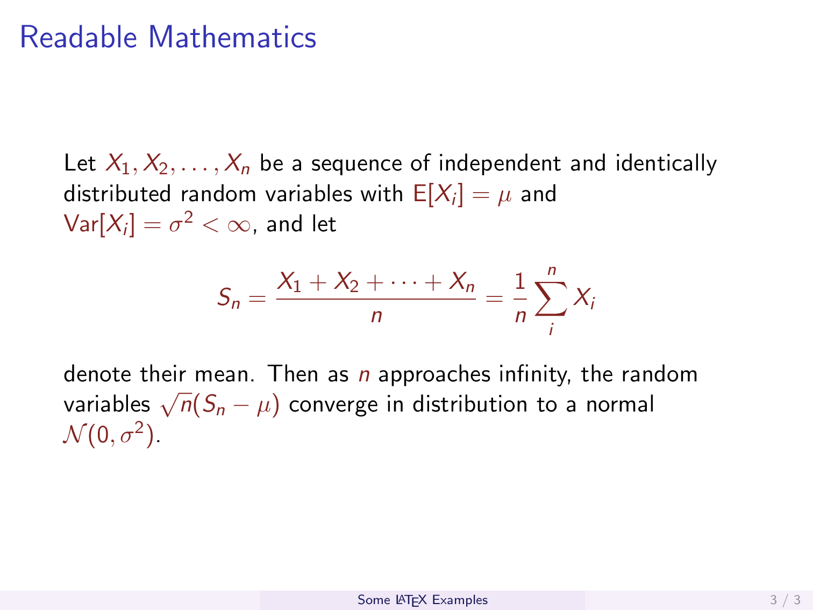

# LaTeX / TeXmacs Templates
Personal customized templates for LaTex and TeXmacs.

## LaTeX
1. Beamer
    + colors for blocks (examples, ...)
    + footline customization

&emsp;&emsp;[Rendered preview](LaTeX/beamer_tpl.pdf)

  
   
  

## TeXmacs
Not available yet.
Making customized templates for TeXmacs **was** my plan, I just don't know when I would start working on it.
